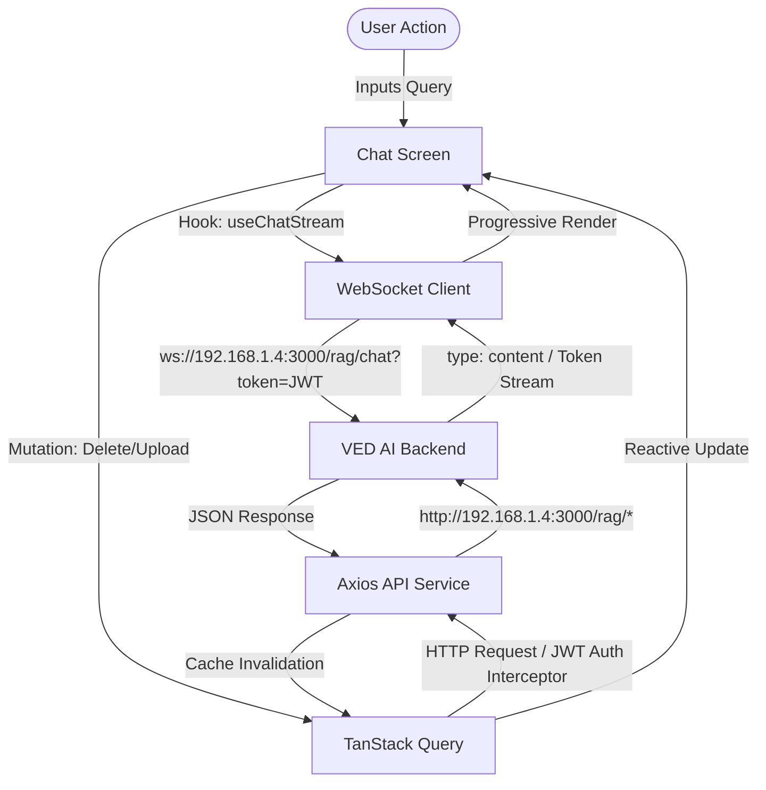

# ⚡ VED Assistant — Premium Mobile AI Interface

A production-grade, fintech-quality React Native Android assistant application designed to deliver real-time Retrieval-Augmented Generation (RAG) capabilities. Built on a modern **Glassmorphism** design system with Expo and TypeScript, VED Assistant pairs with the VED AI backend to manage conversations, view document analytics, and orchestrate agent interactions.

---

## ✨ System Features

*   **💎 Material You Glassmorphism UI**: High-fidelity, dark-mode-first aesthetic utilizing premium frosted glass overlays (`rgba(255, 255, 255, 0.08)`), vivid aurora ambient background meshes, dynamic linear gradients, and smooth micro-animations.
*   **⚡ Encapsulated State Management**: Modern caching and data-fetching layer via **TanStack Query (React Query)**, automating state synchronization for user profiles, historical logs, vector documents, and session deletion.
*   **🔒 Hardened Session Persistence**: Secure JWT storage using `expo-secure-store`, using custom client interceptors to prevent circular-dependency crashes and maintain secure, persistent login states.
*   **📡 Real-Time WebSocket Streaming**: Instantaneous token-by-token message streaming via a native WebSocket engine, automatically resuming state on new user messages or server completions.
*   **✅ Type-Safe Validation**: Integrated client-side form-validation schema powered by `zod` for robust data verification during register/login screens.
*   **📂 Integrated Document Manager**: Knowledge base hub screen allowing users to view uploaded PDF metadata and directly delete files and matching vector chunks from the database.

---

## 🧱 Client-Server Architecture



---

## 🛠️ Technical Stack & dependencies

*   **Runtime Core**: React Native & Expo SDK (v56.0.0)
*   **Routing Engine**: Expo Router (File-based navigation)
*   **State & Cache**: @tanstack/react-query (v5)
*   **Networking**: Axios HTTP Client & HTML5 WebSocket API
*   **Device Encryption**: expo-secure-store
*   **Visual Enhancements**: Expo Linear Gradient, React Native Reanimated (v3)
*   **Input Verification**: Zod Validation Schemas

---

## 📁 Directory Structure

```text
src/
├── app/                  # File-based routes (Expo Router navigation)
├── auth/             # Onboarding, login, and registration screens
│   ├── drawer/           # Secure layout containing home chat and document screens
│   │   ├── index.tsx     # Principal Chat interface
│   │   ├── documents.tsx # Knowledge Base Document center
│   │   └── _layout.tsx   # Custom Drawer screen registry and configurations
│   └── _layout.tsx       # Main app layout, provider setup (Query, Auth Context)
├── components/           # Reusable graphical interface components
│   ├── auth/             # Auth inputs, social button icons, and glowing meshes
│   ├── chat/             # Message bubbles, inputs, and suggestion cards
│   └── ui/               # Custom glassmorphic cards and loading indicators
├── constants/            # Design tokens, font configurations, spacing, and colors
├── hooks/                # Custom hooks (e.g. queries.ts, useChatStream.ts)
├── services/             # Endpoint services (RAG, auth, user endpoints)
└── utils/                # Utility helpers (Secure token store, Query client)
```

---

## 🚀 Getting Started

### Prerequisites

Ensure you have Node.js (v18+) and npm installed on your development machine.

### 1. Install Dependencies
```bash
npm install
```

### 2. Configure Host Connection
The service client interacts with the RAG backend. Make sure the base URL in `src/services/index.ts` points to your active backend's IP address:
```typescript
// src/services/index.ts
constructor(baseURL: string = "http://192.168.1.4:3000") { ... }
```

### 3. Clear Caches and Initialize Metro
Since the application utilizes modern ECMAScript specifications (ESM) required by TanStack Query, build and resolve dependencies by clearing your resolver cache:
```bash
npx expo start -c
```

### 4. Build and Compile Verification
Validate type checks and compile verification:
```bash
npx tsc --noEmit
```

---

## 🔒 Security Operations & Authentication Pipeline

1.  **Asynchronous Token Interception**:
    Every REST api request sent via the `Service` client runs through an interceptor. It fetches the active JWT token from the device's hardware encrypted secure storage (`expo-secure-store`) and attaches it as a `Bearer` token header.
2.  **App Launch Session Restoration**:
    During initial app bundle resolution, the root layout queries `SecureStore`. If a valid session token is found, the app bypasses onboarding/auth pages, automatically loading user data and routing directly to the core Drawer interface.
3.  **WebSocket Authentication Protocol**:
    WS channels cannot attach custom HTTP header payloads natively. Authenticated WebSocket sessions are established by appending the JWT token securely as a query string parameter on connection initialization.
